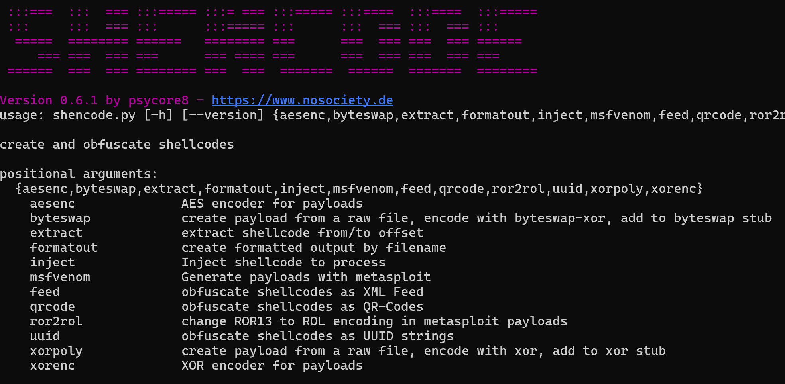

# ShenCode

**A versatile tool for working with shellcodes.**

## Features

### Version 0.6.1

- general
	- `extract` - [extract](https://www.heckhausen.it/shencode/wiki/extract) from/to offset
	- `formatout` - [display raw shellcodes](https://www.heckhausen.it/shencode/wiki/formatout) in `C++, C#` and more
	- `inject` - [inject shellcode](https://www.heckhausen.it/shencode/wiki/inject) into process (Windows only)
	- `msfvenom` - [create payloads](https://www.heckhausen.it/shencode/wiki/msfvenom)  with msfvenom
- encoder
	- `aesenc` - [Encrypt](https://www.heckhausen.it/shencode/wiki/aesenc) payload with AES
	- `byteswap` - New XOR Encryption, [Swapping Bytes](https://www.heckhausen.it/shencode/wiki/byteswap) ([Blog Post](https://www.nosociety.de/en:it-security:blog:obfuscation_byteswapping))
	- `xorenc` - [Encode payload](https://www.heckhausen.it/shencode/wiki/xorenc) with custom XOR key
	- `xorpoly` - [polymorphic x64](https://www.heckhausen.it/shencode/wiki/xorpoly) in-memory decoder (for details, visit this [Blog Post](https://www.nosociety.de/en:it-security:blog:obfuscation_polymorphic_in_memory_decoder))
- obfuscator
	- `Feed` - Splits Bytes in a [feed.xml file](https://www.heckhausen.it/shencode/wiki/feed) as article IDs
	- `QR-Code` hide OpCodes as [QR-Code image](https://www.heckhausen.it/shencode/wiki/qrcode)
	- `ROR13` to `ROL` [conversion with custom key](https://www.heckhausen.it/shencode/wiki/ror2rol) (Windows only)
	- `UUID` [obfuscation](https://www.heckhausen.it/shencode/wiki/uuid) - Please, check out my [Blog Post](https://www.nosociety.de/en:it-security:blog:obfuscation_shellcode_als_uuids_tarnen_-_teil_1) about this encoder

## How to use

Check out the [ShenCode Docs](https://heckhausen.it/shencode/wiki/) for more information.

## Release Notes

- `feed` - A new obfuscation module
- `core` - added some different logos for startup

## References

- [Byte-Swapping](https://www.nosociety.de/en:it-security:blog:obfuscation_byteswapping)
- [In-Memory Decoder](https://www.nosociety.de/en:it-security:blog:obfuscation_polymorphic_in_memory_decoder)
- [Function Name Hashing](https://www.bordergate.co.uk/function-name-hashing/)
- [Win32API with python3 injection](https://systemweakness.com/win32api-with-python3-part-iii-injection-6dd3c1b99c90)
- [Violent python: XOR Encryption](https://samsclass.info/124/proj14/VPxor.htm)
- [How to easily encrypt file in python](https://www.stackzero.net/how-to-easily-encrypt-file-in-python/)
