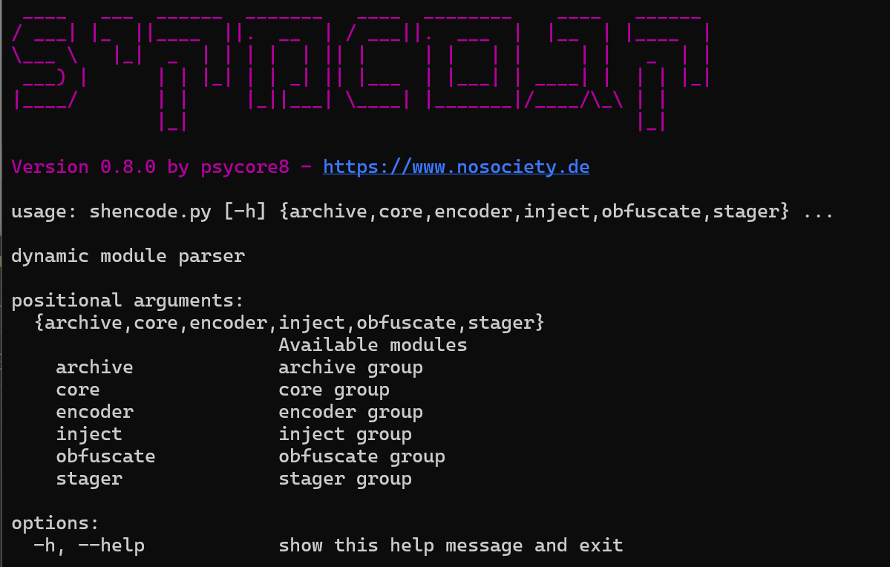

# ShenCode

**A versatile tool for working with shellcodes.**



## Features

### Version 0.8.1

- **core**
	- `extract` - [extract](https://www.heckhausen.it/shencode/wiki/core/extract) from/to offset
	- `msfvenom` - [create payloads](https://www.heckhausen.it/shencode/wiki/core/msfvenom)  with msfvenom
	- `output` - [Inspect and display](https://www.heckhausen.it/shencode/wiki/core/output) files in different formats
	- `task` - [execute a task](https://www.heckhausen.it/shencode/wiki/core/task) to automate ShenCode
- **encoder**
	- `aes` - [Encrypt](https://www.heckhausen.it/shencode/wiki/encoder/aes) payload with AES
	- `bytebert` - [advanced polymorphic](https://www.heckhausen.it/shencode/wiki/encoder/bytebert) encoder
	- `byteswap` - New XOR Encryption, [Swapping Bytes](https://www.heckhausen.it/shencode/wiki/encoder/byteswap) ([Blog Post](https://www.nosociety.de/en:it-security:blog:obfuscation_byteswapping))
	- `xor` - [Encode payload](https://www.heckhausen.it/shencode/wiki/encoder/xor) with custom XOR key
	- `xorpoly` - [polymorphic x64](https://www.heckhausen.it/shencode/wiki/encoder/xorpoly) in-memory decoder (for details, visit this [Blog Post](https://www.nosociety.de/en:it-security:blog:obfuscation_polymorphic_in_memory_decoder))
- **inject**
	- `dll` - [inject a dll](https://www.heckhausen.it/shencode/wiki/inject/dll) into a process
	- `injection` - [inject shellcode](https://www.heckhausen.it/shencode/wiki/inject/injection) into process (Windows only)
	- `ntinjection` - [native injection](https://www.heckhausen.it/shencode/wiki/inject/ntinjection) with undocumented windows functions
	- `psoverwrite` - [process overwriting](https://www.heckhausen.it/shencode/wiki/inject/psoverwrite) injection technique by [hasherezade](https://github.com/hasherezade/process_overwriting)
- **obfuscate**
	- `Feed` - Splits Bytes in a [feed.xml file](https://www.heckhausen.it/shencode/wiki/obfuscate/feed) as article IDs
	- `QR-Code` hide OpCodes as [QR-Code image](https://www.heckhausen.it/shencode/wiki/obfuscate/qrcode)
	- `ROR13` to `ROL` [conversion with custom key](https://www.heckhausen.it/shencode/wiki/obfuscate/rolhash) (Windows only)
	- `UUID` [obfuscation](https://www.heckhausen.it/shencode/wiki/obfuscate/uuid) - Please, check out my [Blog Post](https://www.nosociety.de/en:it-security:blog:obfuscation_shellcode_als_uuids_tarnen_-_teil_1) about this encoder
-  **stager**
	- `meterpreter` - Initiate a `meterpreter/reverse_tcp` [stage](https://www.heckhausen.it/shencode/wiki/stager/meterpreter)
	- `sliver` - Initiate a `https` [sliver stage](https://www.heckhausen.it/shencode/wiki/stager/sliver)

## How to use

##### Install

```shell
git clone https://github.com/psycore8/shencode
cd shencode
pip install .
shencode -h
```

#### General usage

Check out the [ShenCode Docs](https://heckhausen.it/shencode/wiki/) for more information.

## Release Notes

- `core/extract` - added nargs argument `--extract-range <start-byte> <end-byte>`
- `core/extract` - added section extraction `--extract-section <section-name>`
- `encoder/aes` - changed 
- `encoder/bytebert` - module is working now, as expected: create ASM-Script, compile, extract shellcode
- `encoder/xor` - fixed typo
- `stager/sliver` - changed AES argument to nargs: `--aes <aes-key> <aes-iv>`

## References

- [Byte-Swapping](https://www.nosociety.de/en:it-security:blog:obfuscation_byteswapping)
- [In-Memory Decoder](https://www.nosociety.de/en:it-security:blog:obfuscation_polymorphic_in_memory_decoder)
- [Function Name Hashing](https://www.bordergate.co.uk/function-name-hashing/)
- [Win32API with python3 injection](https://systemweakness.com/win32api-with-python3-part-iii-injection-6dd3c1b99c90)
- [Violent python: XOR Encryption](https://samsclass.info/124/proj14/VPxor.htm)
- [How to easily encrypt file in python](https://www.stackzero.net/how-to-easily-encrypt-file-in-python/)
