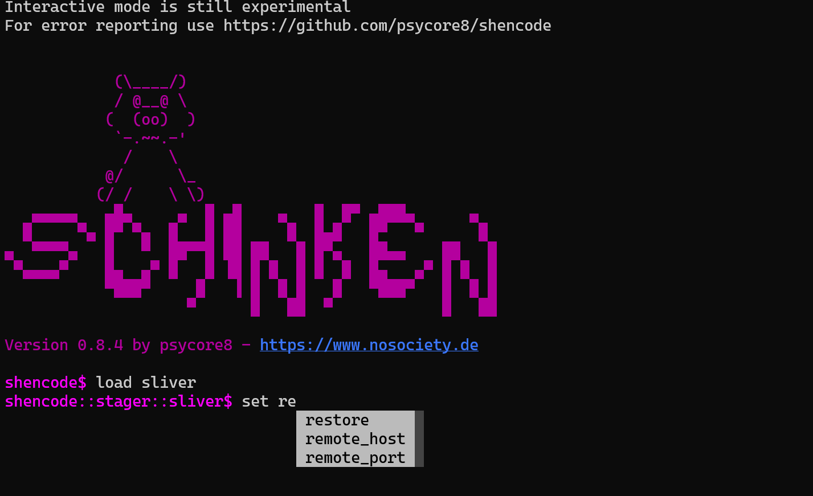

# ShenCode

> **A versatile tool for working with shellcodes.**


## Features

ShenCode is a framework for developing, analyzing and testing shellcodes. It comes with 3 operating modes:

- Argument mode
	- `shencode core output -i file.raw -s inspect`
- [[getting-started#Interactive|Interactive mode]]
	- `shencode$ load output`
	- `shencode::core::output$`
- [[task|Task mode]]
	- Automate modules in different steps with `json`

### Version 0.8.5

#### General usage

Check out [ShenCode Docs](https://heckhausen.it/shencode/wiki/) and [the starter tutorial](https://heckhausen.it/shencode/wiki/getting-started) for more information.

| Category    | Module        | Description                                    | Docs                                                                 | Refs                                                                                                      |
| ----------- | ------------- | ---------------------------------------------- | -------------------------------------------------------------------- | --------------------------------------------------------------------------------------------------------- |
| `core`      | `download`    | Download remote files                          | [download](https://www.heckhausen.it/shencode/core/download)         |                                                                                                           |
| `core`      | `extract`     | Extract a range of bytes from a file           | [extract](https://www.heckhausen.it/shencode/core/extract)           |                                                                                                           |
| `core`      | `minidump`    | Dump a process from memory to disk             | [minidump](https://www.heckhausen.it/shencode/core/minidump)         |                                                                                                           |
| `core`      | `output`      | Inspect and display files in different formats | [output](https://www.heckhausen.it/shencode/core/output)             |                                                                                                           |
| `core`      | `subproc`     | Execute an external subprocess                 | [subproc](https://www.heckhausen.it/shencode/core/subproc)           |                                                                                                           |
| `core`      | `task`        | Execute tasks to automate ShenCode             | [task](https://www.heckhausen.it/shencode/core/task)                 |                                                                                                           |
| `encoder`   | `alphanum`    | Alphanumeric encoder to avoid null bytes       | [alphanum](https://www.heckhausen.it/shencode/encoder/alphanum)      |                                                                                                           |
| `encoder`   | `bytebert`    | Advanced polymorphic encoder                   | [bytebert](https://www.heckhausen.it/shencode/encoder/bytebert)      |                                                                                                           |
| `encoder`   | `byteswap`    | New XOR Encryption, Swapping Bytes             | [byteswap](https://www.heckhausen.it/shencode/encoder/byteswap)      | [Blog Post](https://www.nosociety.de/en:it-security:blog:obfuscation_byteswapping)                        |
| `encoder`   | `multicoder`  | Multi-Algorithm encoder                        | [multicoder](https://www.heckhausen.it/shencode/encoder/multicoder)  |                                                                                                           |
| `encoder`   | `xor`         | Encode payload with custom XOR key             | [xor](https://www.heckhausen.it/shencode/encoder/xor)                |                                                                                                           |
| `encoder`   | `xorpoly`     | Polymorphic x64 in-memory decoder              | [xorpoly](https://www.heckhausen.it/shencode/encoder/xorpoly)        | [Blog Post](https://www.nosociety.de/en:it-security:blog:obfuscation_polymorphic_in_memory_decoder)       |
| `inject`    | `dll`         | Inject dll into a process                      | [dll](https://www.heckhausen.it/shencode/inject/dll)                 |                                                                                                           |
| `inject`    | `injection`   | Inject shellcode into a process                | [injection](https://www.heckhausen.it/shencode/inject/injection)     |                                                                                                           |
| `inject`    | `linject`     | Linux injection method                         | [linject](https://www.heckhausen.it/shencode/inject/linject)         |                                                                                                           |
| `inject`    | `ntinjection` | Inject with native windows API                 | [ntinjection](https://www.heckhausen.it/shencode/inject/ntinjection) |                                                                                                           |
| `inject`    | `psoverwrite` | Process overwriting injection                  | [psoverwrite](https://www.heckhausen.it/shencode/inject/psoverwrite) | [hasherezade](https://github.com/hasherezade/process_overwriting)                                         |
| `obfuscate` | `feed`        | Hide shellcode bytes in a feed.xml file        | [feed](https://www.heckhausen.it/shencode/obfuscate/feed)            |                                                                                                           |
| `obfuscate` | `qrcode`      | Generate QR-Code from a file                   | [qrcode](https://www.heckhausen.it/shencode/obfuscate/qrcode)        |                                                                                                           |
| `obfuscate` | `rolhash`     | ROR13 to custom ROL hashing                    | [rolhash](https://www.heckhausen.it/shencode/obfuscate/rolhash)      |                                                                                                           |
| `obfuscate` | `uuid`        | Generate UUIDs from shellcode                  | [uuid](https://www.heckhausen.it/shencode/obfuscate/uuid)            | [Blog Post](https://www.nosociety.de/en:it-security:blog:obfuscation_shellcode_als_uuids_tarnen_-_teil_1) |
| `payload`   | `msfvenom`    | Create payloads with msfvenom                  | [msfvenom](https://www.heckhausen.it/shencode/payload/msfvenom)      |                                                                                                           |
| `payload`   | `winexec`     | Create a shellcode with custom WinExec command | [winexec](https://www.heckhausen.it/shencode/payload/winexec)        |                                                                                                           |
| `stager`    | `meterpreter` | Download a meterpreter reverse tcp stage       | [meterpreter](https://www.heckhausen.it/shencode/stager/meterpreter) |                                                                                                           |
| `stager`    | `sliver`      | Download  a sliver stage                       | [sliver](https://www.heckhausen.it/shencode/stager/sliver)           |                                                                                                           |

## How to use

##### Install

```shell
git clone https://github.com/psycore8/shencode
cd shencode
python -m venv .venv
<! ACTIVATE-VENV-SEE-BELOW !>
pip install .
shencode -h
```

To activate the virtual environment use the following command:

- Windows - `.venv\bin\activate`
- Linux - `source .venv/bin/activate`

## Release Notes

- `general` - 
- `inject/psoverwrite` - Fixed NoCFG setting
- `stager/sliver` - AES integration check
- `stager/sliver` - argument problems
## References

- [Byte-Swapping](https://www.nosociety.de/en:it-security:blog:obfuscation_byteswapping)
- [In-Memory Decoder](https://www.nosociety.de/en:it-security:blog:obfuscation_polymorphic_in_memory_decoder)
- [Function Name Hashing](https://www.bordergate.co.uk/function-name-hashing/)
- [Win32API with python3 injection](https://systemweakness.com/win32api-with-python3-part-iii-injection-6dd3c1b99c90)
- [Violent python: XOR Encryption](https://samsclass.info/124/proj14/VPxor.htm)
- [How to easily encrypt file in python](https://www.stackzero.net/how-to-easily-encrypt-file-in-python/)
