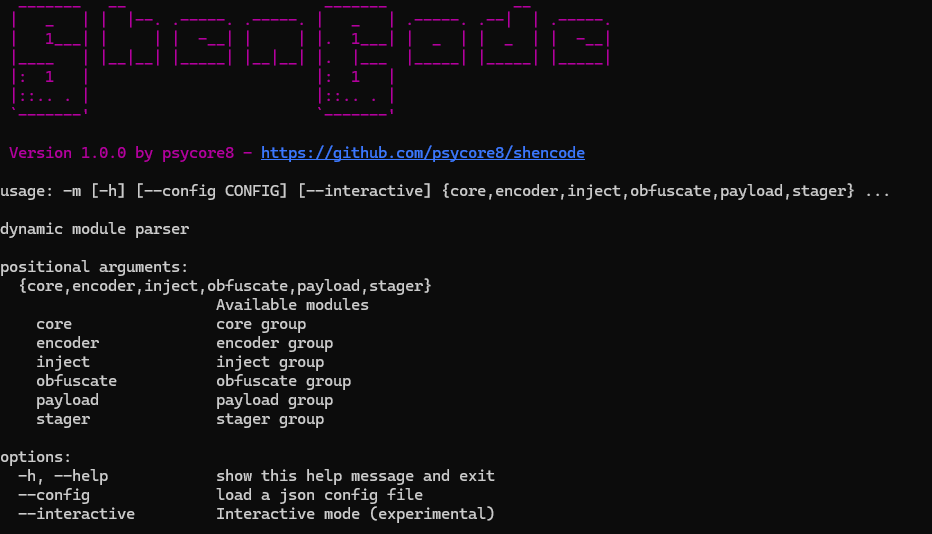

---
tags:
  - Label/Repo
title: ShenCode
Version: 1.0.0
Release:
---
# ShenCode

> **A versatile tool for working with shellcodes.**



## Features

ShenCode is a framework for developing, analyzing and testing shellcodes. It supports the following operating modes:

- Argument mode
	- `shencode core output -i file.raw -s inspect`
- [Interactive Mode](https://psy8.dev/shencode/getting-started#interactive)
	- `shencode$ load output`
	- `shencode::core::output$`
- [Task Mode](https://psy8.dev/shencode/core/task)
	- Automate modules in different steps with `json`

### Version 1.0.0

#### General usage

Check out [ShenCode Docs](https://psy8.dev/shencode/) and [the starter tutorial](https://psy8.dev/shencode/getting-started) for more information.

#### Modules

| Category    | Description                      | Modules                                                                                                                                                                                                                                                                                                                                                                                                                                                                                  |
| ----------- | -------------------------------- | ---------------------------------------------------------------------------------------------------------------------------------------------------------------------------------------------------------------------------------------------------------------------------------------------------------------------------------------------------------------------------------------------------------------------------------------------------------------------------------------- |
| `core`      | Shencode core functions          | [download](https://psy8.dev/shencode/core/download) - [extract](https://psy8.dev/shencode/core/extract)- [inspect](https://psy8.dev/shencode/core/inspect) -  [minidump](https://psy8.dev/shencode/core/minidump) - [output](https://psy8.dev/shencode/core/output) - [subproc](https://psy8.dev/shencode/core/subproc) - [task](https://psy8.dev/shencode/core/task)                                                     |
| `encoder`   | Shellcode encoder                | [alphanum](https://psy8.dev/shencode/encoder/alphanum) - [bytebert](https://psy8.dev/shencode/encoder/bytebert) - [byteswap](https://psy8.dev/shencode/encoder/byteswap)[^byteswap] - [multicoder](https://psy8.dev/shencode/encoder/multicoder) - [xor](https://psy8.dev/shencode/encoder/xor) - [xorchain](https://psy8.dev/shencode/encoder/xorchain) - [xorpoly](https://psy8.dev/shencode/encoder/xorpoly)[^xorpoly] |
| `inject`    | Process injection modules        | [dll](https://psy8.dev/shencode/inject/dll) - [injection](https://psy8.dev/shencode/inject/injection) - [linject](https://psy8.dev/shencode/inject/linject) - [ntinjection](https://psy8.dev/shencode/inject/ntinjection) - [psoverwrite](https://psy8.dev/shencode/inject/psoverwrite)[^psoverwrite]                                                                                                                                       |
| `obfuscate` | Shellcode obfuscation techniques | [feed](https://psy8.dev/shencode/obfuscate/feed)[^feed-dice] - [qrcode](https://psy8.dev/shencode/obfuscate/qrcode) - [rolhash](https://psy8.dev/shencode/obfuscate/rolhash) - [uuid](https://psy8.dev/shencode/obfuscate/uuid)                                                                                                                                                                                                                      |
| `payload`   | Modules to generate payloads     | [msfvenom](https://psy8.dev/shencode/payload/msfvenom) - [winexec](https://psy8.dev/shencode/payload/winexec)                                                                                                                                                                                                                                                                                                                                                          |
| `stager`    | Stage loaders                    | [meterpreter](https://psy8.dev/shencode/stager/meterpreter) - [sliver](https://psy8.dev/shencode/stager/sliver)                                                                                                                                                                                                                                                                                                                                                        |

## How to use

##### Install

```shell
git clone https://github.com/psycore8/shencode
cd shencode
python -m venv .venv
<! ACTIVATE-VENV-SEE-BELOW !>
pip install .
shencode -h
```

To activate the virtual environment use the following command:

- Windows - `.venv\bin\activate`
- Linux - `source .venv/bin/activate`

## Release Notes

- `general` - code cleanup
- `general` - improved output with rich implementation
- `general` - ShenCode as python module
- `core/inspect `- seperated the file inspect function to a module, including html export
- `core/output` - removed inspect
- `core/task` - Improved JSON scheme for better iteration and multiple module usage in one file
- `obfuscate/uuid` - file output and reverse function added
- `stager/meterpreter` - fixed some argument errors
- `stager/sliver` - fixed a datatype error and os.name implementation
- `core/task` - removed deprecated old task module
- `general` - updated dependencies
- `general` - fixed setup.py syntax bug
- `general` - fixed banner bug


## References

- [Byte-Swapping](https://www.nosociety.de/en:it-security:blog:obfuscation_byteswapping)
- [In-Memory Decoder](https://www.nosociety.de/en:it-security:blog:obfuscation_polymorphic_in_memory_decoder)
- [Function Name Hashing](https://www.bordergate.co.uk/function-name-hashing/)
- [Win32API with python3 injection](https://systemweakness.com/win32api-with-python3-part-iii-injection-6dd3c1b99c90)
- [Violent python: XOR Encryption](https://samsclass.info/124/proj14/VPxor.htm)
- [How to easily encrypt file in python](https://www.stackzero.net/how-to-easily-encrypt-file-in-python/)


[^byteswap]: [Byteswapping Blog Post](https://www.nosociety.de/en:it-security:blog:obfuscation_byteswapping)
[^xorpoly]: [Polymorphic XOR decoder Blog Post](https://www.nosociety.de/en:it-security:blog:obfuscation_polymorphic_in_memory_decoder)
[^psoverwrite]: [hasherezade](https://github.com/hasherezade/process_overwriting)
[^feed-dice]: [feed uses a diceware wordlist](https://github.com/ulif/diceware/blob/109df8b50720fd9ee60b414eecb4a097b3b2ba06/diceware/wordlists/wordlist_en_eff.txt)
